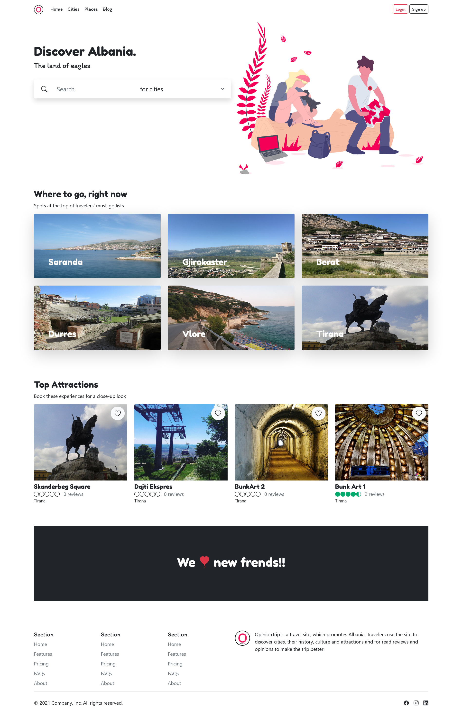
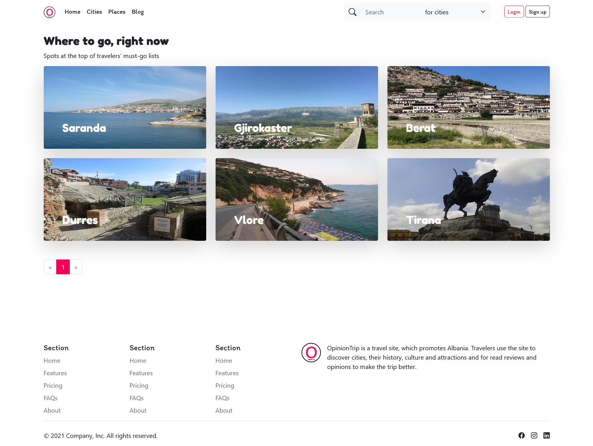
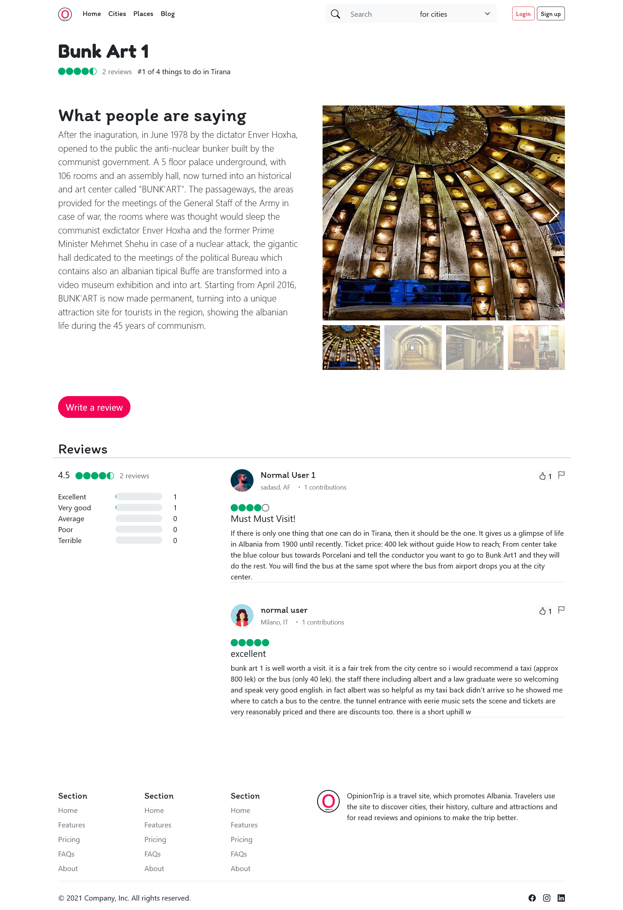
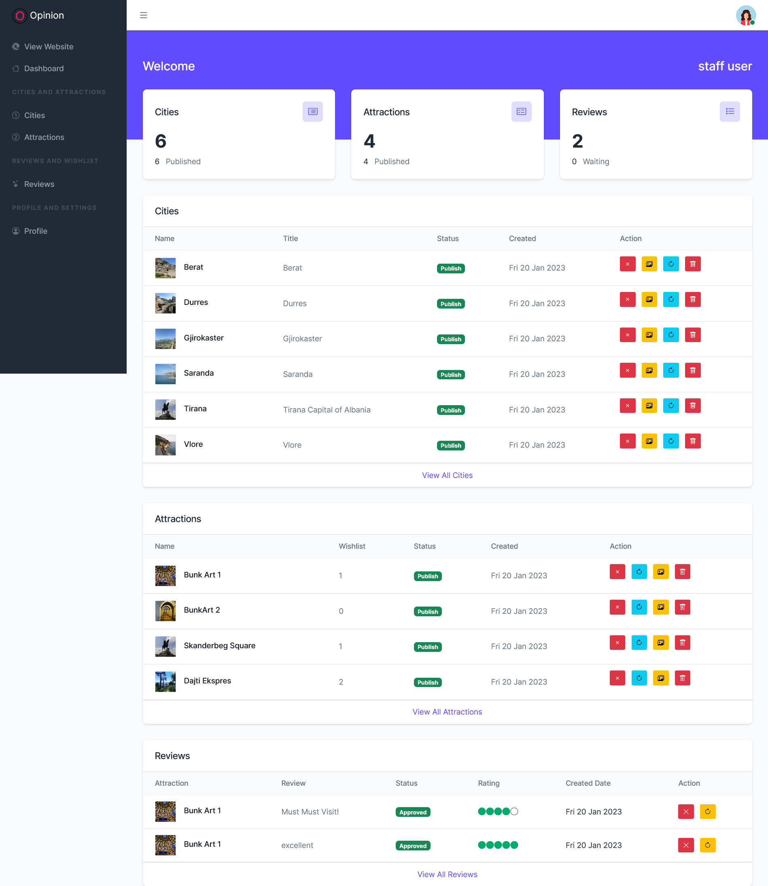
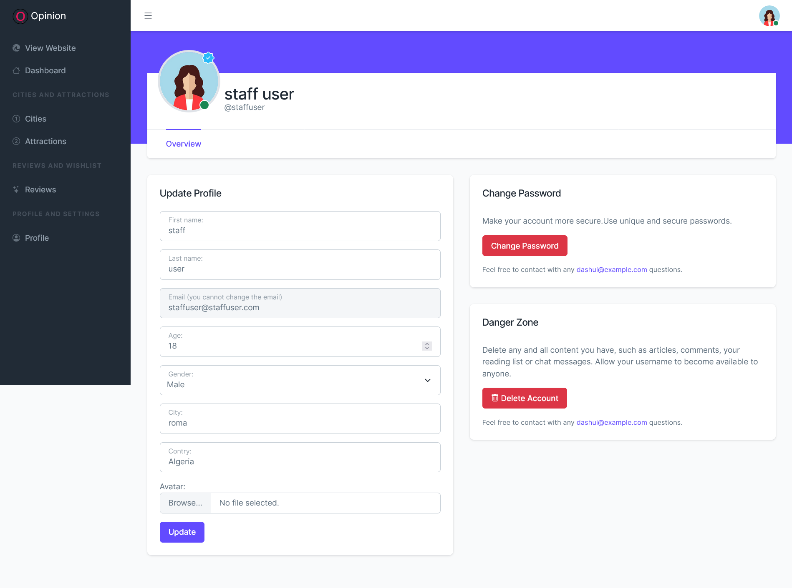

# opinion-trip
Django Trip App

Key Features

1 . Register

2 . Login

3 . File Upload

4 . Form Validation

5 . CRUD Application

6 . Ajax

7 . Search

8 . Customized Dashboard for Users And Staff

9 . and many others

Technologies Used:

Python

Django

Bootstrap

JavaScript

Note :

The Secret_Key required for the execution and debugging of project is not removed from the project code. So you can use the project as your college mini-project or by using the project code you can build your own project.

Usage :

pip install -r requirements.txt

python django_web_app/manage.py makemigrations

python django_web_app/manage.py migrate

python manage.py createsuperuser (enter username, email, password)

python django_web_app/manage.py runserver

In your web browser enter the address : http://localhost:8000 or http://127.0.0.1:8000/

Screenshots:

